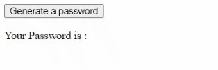

<p>Clarusway</p>

# JS-CC-06 : Random Password Generator

Purpose of the this coding challenge is to write a code that can generate random password for 10 characters as default and expected constraints below.

# Expected Outcome

- password length must be equal to 10
- there should be 3 numbers
- and there should 2 symbols from below:

  ```plaintext
  !@#$%^&*()\_+~|}{[]:;?><,./-=
  ```

  > excluding single and double quotes

- there should be minimum 1 lower and 1 upper case letters,



**valid samples:**

```plaintext
Aa123&!xyz
Aa@/456stu
123aA(p?rs
```

**invalid samples:**

```plaintext
AB123&!XYZ   // no lower case letters
ab123&!xyz   // no upper case letters
Aa@c456stu   // only one symbol
12aA(p?rsz   // only two numbers
```

## Learning Outcomes

At the end of the this coding challenge, students will be able to;

- analyze a problem, identify and apply programming knowledge for appropriate solution.

- demonstrate their knowledge of algorithmic design principles by using JavaScript effectively.

## Problem Statement

- Create a button and it is generate a new password and present it on HTML page.


<p align='center'> <strong>⌛ Happy Coding  ✍</strong> </p>
